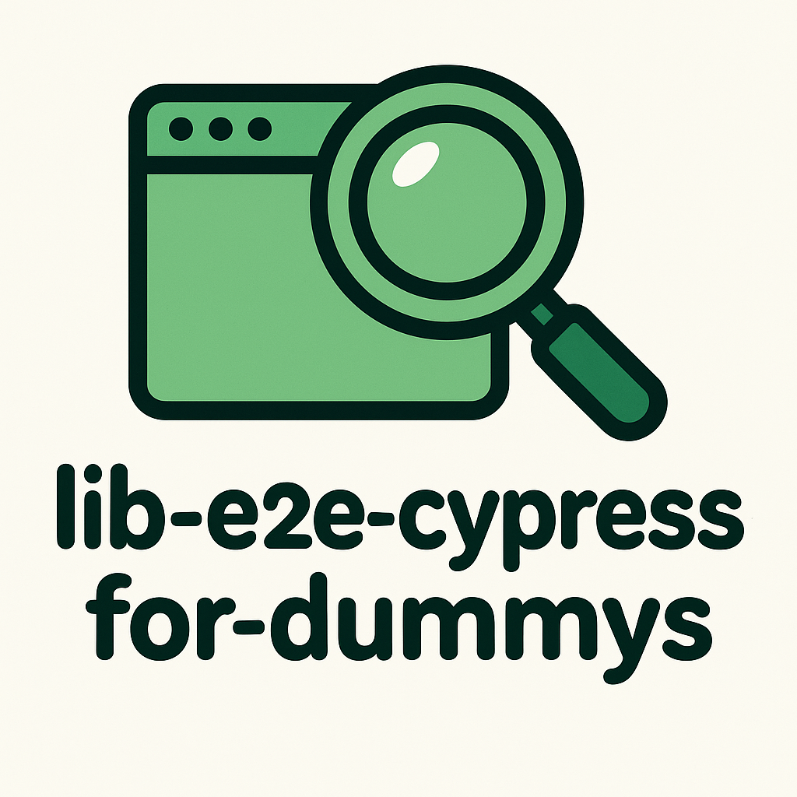

# 🚀 lib-e2e-cypress-for-dummys

<table>
  <tr>
    <td width="200" align="center">
      
    </td>
    <td>
      <p>
        <strong>🇪🇸 <a href="./README.es.md">Leer este README en español</a></strong>
      </p>
      <strong>lib-e2e-cypress-for-dummys</strong> is an Angular library that automatically records the Cypress commands needed to test your application while you browse and use the interface.<br>
      Ideal for developers who want to speed up E2E test creation without writing them manually.<br>
      🎬 Record, copy, save, import/export, and manage your E2E tests in seconds!
    </td>
  </tr>
</table>

## 🧐 What does it do?

- 🎥 Records user interactions (clicks, inputs, selects...) and converts them into Cypress commands (`cy.get(...).click()`, `cy.get(...).type()`, etc.).
- 🌐 Automatically generates commands to intercept and wait for HTTP requests using Cypress (`cy.intercept`, `cy.wait`).
- 🟢 Start and stop recording from a floating button or with keyboard shortcuts (`Ctrl+R`, `Ctrl+1`, `Ctrl+2`, `Ctrl+3`).
- 📋 Export generated commands to paste directly into your Cypress tests.
- 💾 Save and manage your recorded tests in a local IndexedDB database, accessible from the interface.
- 🗂️ View, copy, delete, and organize your saved tests from an advanced visual editor.
- 📦 Import and export all your tests and interceptors in JSON format from the configuration panel.
- ⚙️ Visual configuration panel: select language, manage the database, enable advanced options, and perform migrations.
- 🧩 Support for Cypress interceptors associated with each test.
- 🧠 Generates robust selectors: prioritizes `[data-cy]` and filters auto-generated IDs from frameworks.
- 🌍 Multi-language support: English, Spanish, French, Italian, and German. Selectable from the interface.
- 🔒 Robust persistence: your tests and settings are kept even if you close the browser.
- 🛠️ Advanced HTTP command configuration: enable automatic validations for GET/POST/PUT objects.
- 👀 Quick preview and copy of commands and interceptors from the interface.
- 🗝️ **Direct file/folder access and permissions:** The library now requests and manages permissions to read and write files and folders using the File System Access API. You can select the Cypress folder and save tests directly as files.
- 💾 **Precise file saving and editing:** Edit and save test files directly from the advanced editor. Changes are written to disk with full control and permission management.
- 🪟 **Advanced test editor modal:** Preview, edit, and save test files in a modern modal. Copy the full `it(...)` block or just interceptors to the clipboard with one click.
- 🧩 **Copy helpers:** New buttons allow you to copy the full Cypress test block or only the interceptors, for easy pasting into your codebase.
- 🔒 **Permission renewal:** If file/folder permissions expire, the app will prompt you to re-authorize and will retry the operation automatically.
- 🏷️ **Smart modal closing:** After saving or closing in the advanced editor, all related modals close automatically for a seamless workflow.
- 🖱️ **Modern UI:** All action buttons in the editor are visually consistent, compact, and grouped for quick access.
- 📝 **Clipboard integration:** Copying commands/interceptors uses the browser clipboard API for instant results.
- 🛡️ **Robust error handling:** If a file/folder operation fails due to permissions, the app will guide you to restore access and continue working.

---

## ⚡ Installation

1. Install the library in your Angular project:

```bash
npm install lib-e2e-cypress-for-dummys
```

> **Note:** Required dependencies like `ngx-indexed-db` will be installed automatically if you don’t already have them, as they are listed in the library’s `peerDependencies`.  
> Just make sure you have `@angular/core` and `@angular/common` version **18.0.0 or higher**.

---

## 🚦 Basic Usage

### 1. **Configure IndexedDB**

In your configuration file (e.g., `app.config.ts` or main module):

```typescript
import { NgxIndexedDBModule } from 'ngx-indexed-db';
import { dataBaseConfiguration } from 'lib-e2e-cypress-for-dummys';

@NgModule({
  imports: [
    NgxIndexedDBModule.forRoot(dataBaseConfiguration),
    // ...other imports
  ],
})
export class AppModule {}
```

### 2. **Import the main component into your module or standalone component:**

```typescript
import { LibE2eRecorderComponent } from 'lib-e2e-cypress-for-dummys';
```

### 3. **Add the component in your main template (e.g., in `app.component.html`):**

```html
<lib-e2e-recorder></lib-e2e-recorder>
```

### 4. **Tag elements you want easily selectable by Cypress with the `data-cy` attribute:**

```html
<input data-cy="email-input" type="email" />
<button data-cy="login-button">Login</button>
```

### 5. **(Optional) If you want to record HTTP calls/interceptors as well, add the interceptor to your app config**

```typescript
import { provideHttpClient, withInterceptors } from '@angular/common/http';
import { CypressHttpInterceptor } from 'lib-e2e-cypress-for-dummys';

export const appConfig = {
  providers: [
    // ...other providers...
    provideHttpClient(withInterceptors([CypressHttpInterceptor])),
  ],
};
```

### 6. **Done! Use the interface:**

- Click the floating ▶️ "Record" button or use `Ctrl+R` to start recording. Interact with the app, then press ⏹️ "Stop".
- Click 📋 or `Ctrl+2` to preview generated commands.
- Click 🗂️ or `Ctrl+1` to open the visual test editor (expand, copy, delete, and view associated interceptors).
- Click ⚙️ or `Ctrl+3` to open the configuration panel (language, export/import, advanced options).

---

## 🧩 Advanced Features

- **Multi-language support:** Change the interface language between English, Spanish, French, Italian, and German from the configuration panel.
- **Bulk export/import:** Export all your tests and interceptors to a JSON file and import them into another project or team.
- **Advanced HTTP configuration:** Enable automatic validations for objects in GET/POST/PUT commands.
- **Keyboard shortcuts:** Control recording and open panels quickly (`Ctrl+R`, `Ctrl+1`, `Ctrl+2`, `Ctrl+3`).
- **Visual test editor:** View, copy, delete, and organize your saved tests. Expand each test to see commands and associated interceptors.
- **Quick preview and copy:** Copy Cypress commands or only interceptors to the clipboard with one click.
- **Robust persistence:** All data is stored in IndexedDB and remains even if you close the browser.
- **Smart selector:** Prioritizes `[data-cy]` and filters out auto-generated IDs for robust selectors.
- **DB migration ready:** The database structure is prepared for future migrations and expansions.

---

## 💡 Example of Generated Commands

```js
it('User login', () => {
  cy.viewport(1900, 1200)
  cy.visit('/login')
  cy.get('[data-cy="email-input"]').clear().type('user@domain.com')
  cy.get('[data-cy="password-input"]').clear().type('123456')
  cy.get('[data-cy="login-button"]').click()
  cy.intercept('POST', '**/api/v1/login/**', (req) => {
    if (req.url.includes('login')) {
      req.alias = 'api-v1-login';
    }
  });
  cy.wait('@api-v1-login').then((interception) => { })
});
```

---

## 👍 Recommendations

- Always use the `data-cy` attribute on elements you want to test for robust selectors.
- Generated commands appear in the browser console after stopping the recording and also in the preview interface.
- You can clear the command list by calling `clearCommands()` from the service if needed.
- Tests saved in IndexedDB are persistent: they won’t be deleted when you close the browser or restart the computer (unless manually cleared or using incognito mode).
- To migrate or share your tests across projects, use the export/import functionality from the configuration panel.

---

## ⚠️ Limitations

- Only supports Angular **18+**.
- Commands are generated in the console and UI, not as physical files.
- Does not cover all possible events or custom components.
- If you change the DB structure, make sure to update the version in the configuration to avoid migration errors.

---

## 🚧 Project Status

This library is under active development and may contain bugs or lack certain features.  
If you have suggestions, encounter any issues, or need a new feature, feel free to email me at **gonzalocarmenado@gmail.com**. Your feedback is welcome and helps improve the project!

## 🤝 Contributing

Want to improve the library? Great! You can open issues or pull requests in the repository. If you have any questions, contact the author at **gonzalocarmenado@gmail.com**.

---

## 📄 License

MIT

---

**Author:** Gonzalo