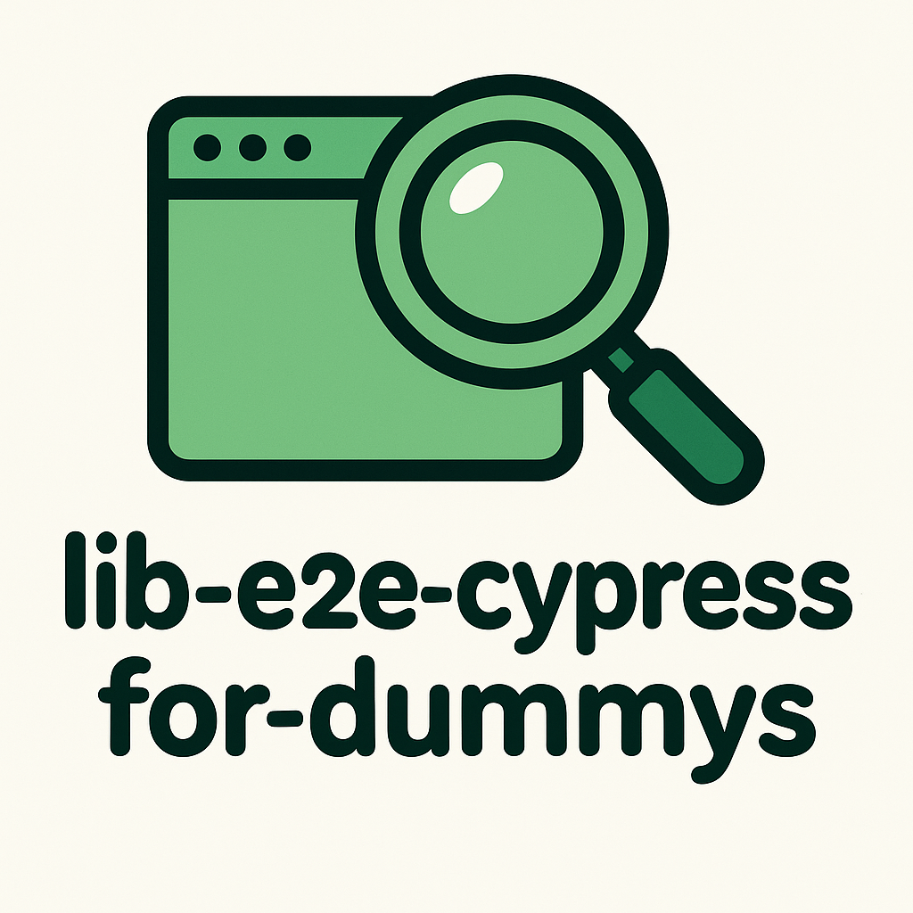

# 🚀 lib-e2e-cypress-for-dummys

<table>
  <tr>
    <td width="200" align="center">
      
    </td>
    <td>
      <strong>lib-e2e-cypress-for-dummys</strong> es una librería Angular que te permite grabar automáticamente los comandos Cypress necesarios para testear tu aplicación mientras navegas y usas la interfaz.<br>
      Ideal para desarrolladores que quieren acelerar la creación de tests E2E sin tener que escribirlos manualmente.<br>
      🎬 ¡Graba, copia, guarda, importa/exporta y gestiona tus tests E2E en segundos!
    </td>
  </tr>
</table>

## 🧐 ¿Qué hace?

- 🎥 Graba interacciones de usuario (clicks, inputs, selects...) y las convierte en comandos Cypress (`cy.get(...).click()`, `cy.get(...).type()`, etc.).
- 🌐 Genera automáticamente comandos para interceptar peticiones HTTP y esperarlas con Cypress (`cy.intercept`, `cy.wait`).
- 🟢 Permite iniciar y parar la grabación desde un botón flotante en la interfaz.
- 📋 Exporta los comandos generados para que los pegues directamente en tus tests Cypress.
- 💾 Permite guardar y gestionar tus pruebas grabadas en una base de datos indexada (IndexedDB) local, accesible desde la propia interfaz.
- 🗂️ Visualiza, copia, elimina y organiza tus pruebas guardadas desde un editor visual.
- 📦 Importa y exporta todos tus tests y configuraciones de la BBDD con un solo clic.
- ⚙️ Panel de configuración para gestionar la base de datos y otras opciones avanzadas.
- 🧩 Soporte para interceptores Cypress asociados a cada test.
- 🧠 Generación de selectores robustos: prioriza `[data-cy]` y filtra ids generados automáticamente por frameworks.

---

## ⚡ Instalación

1. Instala la librería en tu proyecto Angular:

```bash
npm install lib-e2e-cypress-for-dummys
```

> **Nota:** Las dependencias necesarias como `ngx-indexed-db` se instalarán automáticamente si no las tienes, ya que están en las `peerDependencies` de la librería.  
> Solo asegúrate de tener `@angular/core` y `@angular/common` versión **18.0.0 o superior**.

> Es necesario instalar la libreria **primeng"** en la versión que necesites en función de la versión de Angular que utilices.

---

## 🚦 Uso básico

### 1. **Configura la base de datos indexada (IndexedDB)**

En tu archivo de configuración (por ejemplo, `app.config.ts` o tu módulo principal):

```typescript
import { NgxIndexedDBModule } from 'ngx-indexed-db';
import { dataBaseConfiguration } from 'lib-e2e-cypress-for-dummys';

@NgModule({
  imports: [
    NgxIndexedDBModule.forRoot(dataBaseConfiguration),
    // ...otros imports
  ],
})
export class AppModule {}
```

### 2. **Importa el componente principal en tu módulo o componente standalone:**

```typescript
import { LibE2eRecorderComponent } from 'lib-e2e-cypress-for-dummys';
```

### 3. **Añade el componente en tu template principal (por ejemplo, en `app.component.html`):**

```html
<lib-e2e-recorder></lib-e2e-recorder>
```

### 4. **Marca los elementos que quieras que sean fácilmente seleccionables por Cypress usando el atributo `data-cy`:**

```html
<input data-cy="email-input" type="email" />
<button data-cy="login-button">Login</button>
```

### 5. **(Opcional pero recomendado) Si quieres que también se graben las llamadas HTTP/interceptores, añade el interceptor en tu configuración de la app**  
   En tu `app.config.ts`:

```typescript
import { provideHttpClient, withInterceptors } from '@angular/common/http';
import { CypressHttpInterceptor } from 'lib-e2e-cypress-for-dummys';

export const appConfig = {
  providers: [
    // ...otros providers...
    provideHttpClient(withInterceptors([CypressHttpInterceptor])),
  ],
};
```

### 6. **¡Listo! Usa la interfaz:**

- Haz clic en el botón flotante ▶️ "Grabar" para empezar a grabar. Interactúa con la app y, cuando termines, pulsa ⏹️ "Parar".
- Pulsa 📋 para ver el listado de pruebas guardadas (se almacenan en IndexedDB y puedes consultarlas, copiarlas o eliminarlas desde la interfaz).
- Pulsa 📝 para previsualizar los comandos Cypress generados en la sesión actual.
- Pulsa ⚙️ para abrir el panel de configuración, donde puedes importar/exportar toda la base de datos de tests/interceptores.

---

## 🛠️ ¿Cómo funciona?

La librería escucha eventos de usuario (click, input, change) sobre elementos con `data-cy` o `id`, y va generando los comandos Cypress correspondientes.  
Además, si configuras el interceptor, intercepta las peticiones HTTP realizadas por Angular y añade los comandos `cy.intercept` y `cy.wait` necesarios para que tus tests sean robustos.

Cuando guardas una prueba, se almacena en IndexedDB con su descripción, fecha y el bloque Cypress completo generado.  
Puedes consultar, copiar o eliminar pruebas guardadas desde la interfaz de la extensión.  
También puedes importar/exportar toda la base de datos de pruebas e interceptores en formato JSON.

---

## 🧩 Funcionalidades avanzadas

- **Editor visual de pruebas:** Visualiza, copia, elimina y organiza tus pruebas guardadas. Cada test puede expandirse para ver los comandos Cypress y los interceptores asociados.
- **Botón "Copiar":** Copia al portapapeles el bloque completo de comandos Cypress o solo los interceptores asociados.
- **Botón "Eliminar":** Elimina una prueba guardada de la base de datos.
- **Panel de configuración:** Permite exportar todos los tests/interceptores a un fichero JSON e importar desde un fichero para restaurar o migrar datos entre proyectos.
- **Selector inteligente:** Prioriza `[data-cy]` y filtra ids generados automáticamente por frameworks para evitar selectores poco robustos.
- **Migración de BBDD:** La estructura de la base de datos está preparada para migraciones y ampliaciones futuras.

---

## 💡 Ejemplo de comandos generados

```js
it('Login de usuario', () => {
  cy.viewport(1900, 1200)
  cy.visit('/login')
  cy.get('[data-cy="email-input"]').clear().type('usuario@dominio.com')
  cy.get('[data-cy="password-input"]').clear().type('123456')
  cy.get('[data-cy="login-button"]').click()
  cy.intercept('POST', '**/api/v1/login/**', (req) => {
    if (req.url.includes('login')) {
      req.alias = 'api-v1-login';
    }
  });
  cy.wait('@api-v1-login').then((interception) => { })
});
```

---

## 👍 Recomendaciones

- Usa siempre el atributo `data-cy` en los elementos que quieras testear para obtener selectores robustos.
- Los comandos generados aparecen en la consola del navegador al parar la grabación y también en la interfaz de previsualización.
- Puedes limpiar la lista de comandos llamando a `clearCommands()` desde el servicio si lo necesitas.
- Las pruebas guardadas en IndexedDB son persistentes: no se borran al cerrar el navegador ni al reiniciar el ordenador (salvo que el usuario borre manualmente los datos del sitio o use modo incógnito).
- Para migrar o compartir tus pruebas entre proyectos, usa la funcionalidad de exportar/importar desde el panel de configuración.

---

## ⚠️ Limitaciones

- Solo soporta Angular **18+**.
- Los comandos se generan en la consola y en la interfaz, no en un archivo físico.
- No cubre todos los posibles eventos o componentes personalizados.
- Si cambias la estructura de la BBDD, asegúrate de actualizar la versión en la configuración para evitar errores de migración.

---

## 🚧 Estado del proyecto

Esta librería está en desarrollo activo y puede contener errores o carecer de algunas funcionalidades.  
Si tienes sugerencias, encuentras algún problema o necesitas una nueva característica, no dudes en escribirme a **gonzalocarmenado@gmail.com**. ¡Tu feedback es bienvenido y me ayuda a mejorar el proyecto!

## 🤝 Contribuir

¿Quieres mejorar la librería? ¡Genial! Puedes abrir issues o pull requests en el repositorio. Si tienes dudas, contacta con el autor a través del correo **gonzalocarmenado@gmail.com**.

---

## 📄 Licencia

MIT

---

**Autor:** Gonzalo